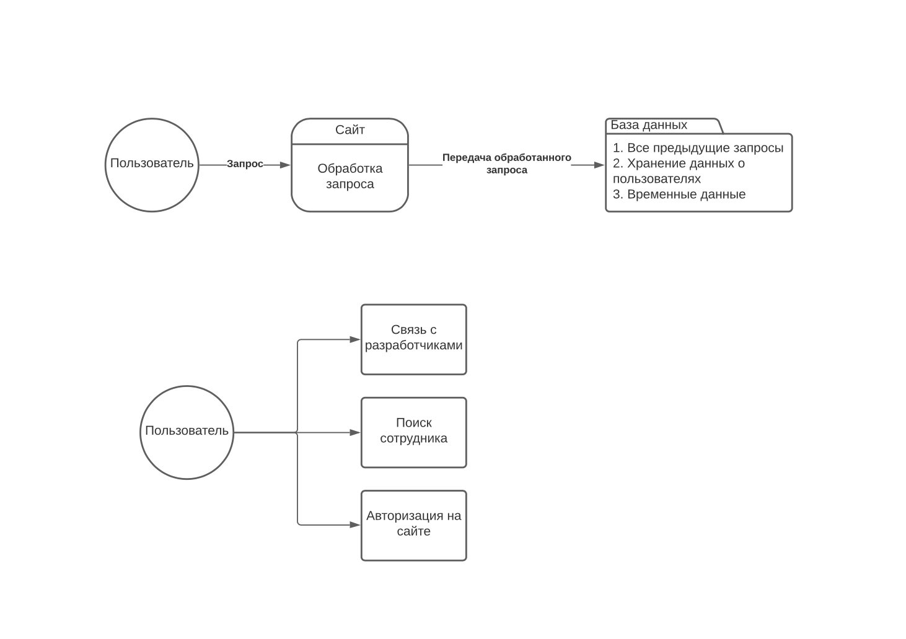

# socarphe

# Socarphe - быстрый поиск эксперта.

это бот

## Содержание
- [What is needed?](https://github.com/ilia2108/AgileDiaryJavaFx#requirements)
- [What is actually a problem?](https://github.com/ilia2108/AgileDiaryJavaFx#problem)
- [How could it be solved?](https://github.com/ilia2108/AgileDiaryJavaFx#solution)
- [How the solution was designed?](https://github.com/ilia2108/AgileDiaryJavaFx#solution)
  - [Model-View-Controller implementation](https://github.com/ilia2108/AgileDiaryJavaFx#model-view-controller)
    - [Model](https://github.com/ilia2108/AgileDiaryJavaFx#model)
    - [View](https://github.com/ilia2108/AgileDiaryJavaFx#view)
    - [Controller](https://github.com/ilia2108/AgileDiaryJavaFx#controller)
  - [Builder implementation](https://github.com/ilia2108/AgileDiaryJavaFx#builder)
  - [Database and all that...](https://github.com/ilia2108/AgileDiaryJavaFx#jdbc)
- [How to deploy?](https://github.com/ilia2108/AgileDiaryJavaFx#deployment-manual)


## Требования

находить чувака

## Проблема

слишком сложно найти чувака

## Решение

сервис по нахождению чувака через нетворкинг в соцсетях и анализ аккаунта пользователя

## Архитектура

This application uses two popular design patterns:
[**Model-View-Controller**](https://en.wikipedia.org/wiki/Model%E2%80%93view%E2%80%93controller) (MVC)
 and [**Builder**](https://en.wikipedia.org/wiki/Builder_pattern). So, let's have a look!
 
 ### Model-View-Controller
 
 The main idea beyond the pattern is to hide the Mode from straight
 manipulation of View. which means that each UI page from View should 
 have its ViewModel.
 
 #### Модель
 
 The model implementation can be examined here:
 
  
  
  Let's go through it step by step:
  * There is the most basic class called ```EntityAbstract```;
  * It has two children: ```Theme``` and ```IssueAbstract```;
  * IssueAbstract has several children: ```Initiative```, ```Epic``` 
  and ```Story```. Each of them is included in previous 
  with **one-to-many** relationship;
  * Theme is also included in each of the children with **one-to-one** relation.
 
 This implementation was chosen becuase of high similarity of objects.
 In this case inheritance helped to realize it in the easiest way.
 #### View
 
 The implementation of MVC in View can be illustrated here:
 
 
 So, let's sum it all up:
 * Each ```.fxml``` page has its own Controller;
 * All the controllers are inherited from ```BaseUIController``` class;
 * Transition between Main page and Create page goes through 
 ```AddIssueEventHandler``` - custom event handler
 that help to set up the page;
 * Then, when the object is added, there is a return to the main page.
 
 Such architecture decision help to **get rid of multiple add pages**, because
 there are simply not necessary in this case.
 
 #### Controller
 
 The controllers architecture can be found here:
 
 
 As you can see, **it is the same as [Model](https://github.com/ilia2108/AgileDiaryJavaFx#model)**.
 So you can have a look at the explanation there. 
 The only thing that I would like to add is the following diagram of
  controllers usage:
  
  
  Let's investigate it:
  * We have a ```MainController``` from View that
   has list of ```ThemeController``` and ```InitiativeController```;
  * Initiative has lists of ```EpicController``` and ```StoryController```
  nested in each previous;
  * ```CreateController``` has ```MainController``` as **one of parameters**.
  So, we do not create another hierarchy, but **use a single one**.
 
### Builder
 
 This pattern was used as another layer of security of model from
 straight changes outside of controllers. **Each model and controller** class
 has its own builder. 
 
 The **common hierarchy also applies as in [Model](https://github.com/ilia2108/AgileDiaryJavaFx#model)**, but there's 
 something special special descripbed here:
 
 
 
 The thing is that each ```ControllerBuilder``` has builder from Model.
 So, **the builder does not touch Model directly as well**.
 
### JDBC

In the project there is a MySQL database.
For that reason the database relation should also be specified.
It is descripbed here:


Too many classes? Let's make it clear:
* First of all, ```MainController``` has as field an object of 
```DatabaseConnector```, which works with all the logic from Main;
* The connector uses **Data Access Object** (DAO) for each entity.
Each of them cooperates with MySQL database;
* Each DAO is **inherited from ```BasicDAO```**.
It sets up the common thing (e.g. connection).

The database schema is the following:


 
## Deployment manual

To deploy this solution you need to fulfill several steps:
* clone this repo using **any way that GitHub allows**;
* open console **in the project directory** 
and run ```docker-compose up --build```.
There will be two services running:
    * ```localhost:8080``` - [Adminer](https://www.adminer.org/) service.
    That is an **open-source UI for databases** like MySQL;
    * ```localhost:3306``` - MySQL database.
    It **has persistent storage** and ```init.sql``` file
    which is mapped from ```mysql-dump``` folder.
* Run JavaFX application. It should be working **after**
you had deployed DB.
