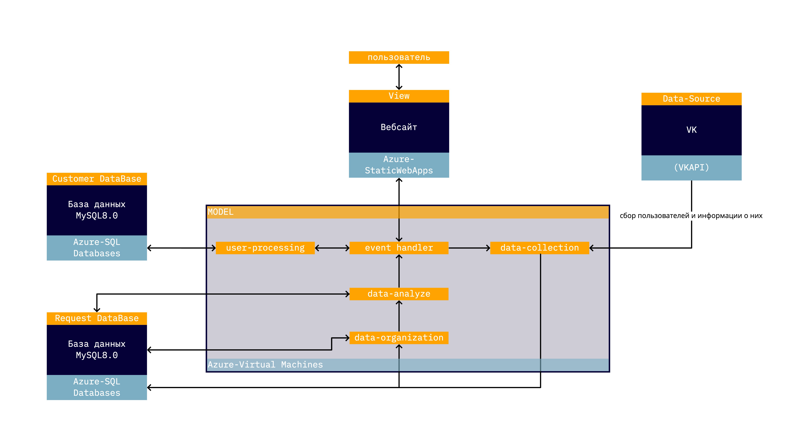
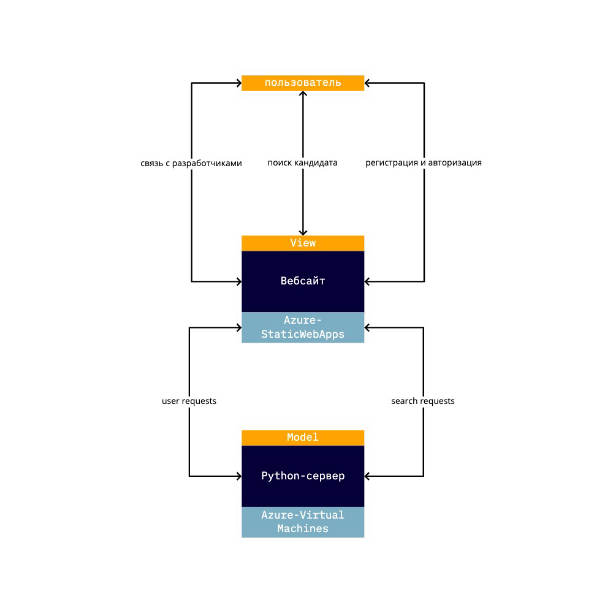

# socarphe - быстрый поиск эксперта.

## Введение
в данном документе cодержится описание проекта, его архитектура, частичный "Domain Analysis" и другие особенности

## Содержание

- [Проблема](https://github.com/timtikh/socarphe#%D0%BF%D1%80%D0%BE%D0%B1%D0%BB%D0%B5%D0%BC%D0%B0)
- [Решение](https://github.com/timtikh/socarphe#%D1%80%D0%B5%D1%88%D0%B5%D0%BD%D0%B8%D0%B5)
- [Архитектура](https://github.com/timtikh/socarphe#%D0%B0%D1%80%D1%85%D0%B8%D1%82%D0%B5%D0%BA%D1%82%D1%83%D1%80%D0%B0)
    - [Компонентная модель](https://github.com/timtikh/socarphe#%D0%BA%D0%BE%D0%BC%D0%BF%D0%BE%D0%BD%D0%B5%D0%BD%D1%82%D0%BD%D0%B0%D1%8F-%D0%BC%D0%BE%D0%B4%D0%B5%D0%BB%D1%8C)
    - [View](https://github.com/timtikh/socarphe#view-%D1%81%D0%B0%D0%B9%D1%82)
    - [DataBase](https://github.com/timtikh/socarphe#database)
    - [Model](https://github.com/timtikh/socarphe#model-python-%D1%81%D0%B5%D1%80%D0%B2%D0%B5%D1%80-%D0%B4%D0%BB%D1%8F-%D1%81%D0%B1%D0%BE%D1%80%D0%B0-%D0%B0%D0%BD%D0%B0%D0%BB%D0%B8%D0%B7%D0%B0-%D0%B8-%D0%BE%D0%B1%D1%80%D0%B0%D0%B1%D0%BE%D1%82%D0%BA%D0%B8-%D0%B4%D0%B0%D0%BD%D0%BD%D1%8B%D1%85)
    - [Референсные архитектуры](https://github.com/timtikh/socarphe#%D1%80%D0%B5%D1%84%D0%B5%D1%80%D0%B5%D0%BD%D1%81%D0%BD%D1%8B%D0%B5-%D0%B0%D1%80%D1%85%D0%B8%D1%82%D0%B5%D0%BA%D1%82%D1%83%D1%80%D1%8B)
- [(Не-)Функциональные требования](https://github.com/timtikh/socarphe/#%D0%BD%D0%B5-%D1%84%D1%83%D0%BD%D0%BA%D1%86%D0%B8%D0%BE%D0%BD%D0%B0%D0%BB%D1%8C%D0%BD%D1%8B%D0%B5-%D1%82%D1%80%D0%B5%D0%B1%D0%BE%D0%B2%D0%B0%D0%BD%D0%B8%D1%8F)
- [Осуществление доступа пользователя](https://github.com/timtikh/socarphe#%D0%BE%D1%81%D1%83%D1%89%D0%B5%D1%81%D1%82%D0%B2%D0%BB%D0%B5%D0%BD%D0%B8%D0%B5-%D0%B4%D0%BE%D1%81%D1%82%D1%83%D0%BF%D0%B0-%D0%BF%D0%BE%D0%BB%D1%8C%D0%B7%D0%BE%D0%B2%D0%B0%D1%82%D0%B5%D0%BB%D1%8F)
- [Use-Cases](https://github.com/timtikh/socarphe#use-cases)
- [Клиенты и пользователи](https://github.com/timtikh/socarphe#%D0%BA%D0%BB%D0%B8%D0%B5%D0%BD%D1%82%D1%8B-%D0%B8-%D0%BF%D0%BE%D0%BB%D1%8C%D0%B7%D0%BE%D0%B2%D0%B0%D1%82%D0%B5%D0%BB%D0%B8)

## Проблема

Начнем с большого исследования авторитетного агенства CBI insights - почему проваливались стартапы. Фаундеров спрашивали об их основных ошибках и они называли ряд проблем, которые по их мнению развалили стартап.

Более четверти респондентов отметили проблемы, связанные с сотрудниками.
То есть более четверти стартапов по мнению фаундеров развалилилсь по причине неудачного подбора и состава команды.

Но это еще не все, усугубляет подбор сотруников и время, которое тратится на это. Дэвид Скок, авторитетный инвестор и создатель популярного портала утверждает что до 70% фаундер тратит времени на подбор сотрудника. 

Получаем проблему: **поиск подходящего специалиста-энтузиаста в небольшой проект/startup требует очень много временных ресурсов и довольно часто напрямую влияет на развал проекта**

## Решение

Мы предлагаем мультиплатформенный сервис по оперативному нахождению кандидата в проект через нетворкинг аккаунта в соц. сети. 

Нетворкинг является ключевой идеей в поиске кандидатов, по данным LinkedIn он закрывает до 70% вакансий в молодой кампании. А если мы его автоматизируем, то и сократим кол-во потраченных ресурсов на подбор кандидата.

## Архитектура

Выбрали для нашей системы традиционную многослойную архитектуру с четырьмя блоками. Вебсайт - View, Сервер-обработчик данных - Model, Общая База данных - DataBase, Источник данных - Data-Source. Пользователь взаимодействует с системой через блок View.

 ### Компонентная модель
 
 

Блоки коммуницируют слоями. View-Model-DataBase, где DataBase это смесь из трех баз данных - учетные записи пользователей и данные о пользователях вк.

С помощью Azure мы разворачиваем все три блока, так как на площадке присутствуют подходящие нам решения. 
- StaticWebApps для сайта
- Virtual Machines для сервера
- SqlDatabases для БД

для источника данных требуется API от ВК - доступ к нему бесплатный(свободный).

 #### View (сайт)

База сайта будет написана на HTML, CSS 4 и JavaScript. 

Конкретно фреймворк Bootstrap, который поможет быстро сверстать сайт. Содержит инструменты для создания макета сайта и базового функционала: кнопок, форм, горизонтальных и вертикальных навигационных панелей, слайдеров, выпадающих списков, аккордеонов, модальных окон, всплывающих подсказок и др.

Кроме того планируется использование фреймворка React JS, который сделает код более понятным. Для того, чтобы предоставить клиенту базу данных мы будем использовать веб сервер (Apache и Nginx), который в свою очередь формирует запрос, обращается к главному серверу, получает информацию, дополнительно он может ее обработать и в итоге вывести.

От пользователя требуется только авторизация/регистрация и данные по поиску. Сайт также используется для приобретения премиум-статуса. На сервер запросы посылаются на JS .
 
 
 
юзкейсы сайта
 
 

основные используемые фреймворки

 #### DataBase
 
 как устроена БД:
 
 
 
 БД делится на три части - 
 - список пользователей и информации о них
 - очередь запросов
 - история запросов
 
 история запросов и очередь выделены в один большой блок
 
 
 #### Model (Python-сервер для сбора анализа и обработки данных)
 
 Ниже логика работы сервера
 
 
 
 Ниже подробное описание проверки статуса пользователя для определения параметров поиска.
 
 
 
 ## Референсные архитектуры
 
 [**Analytics and AI architecture by IBM**]( https://www.ibm.com/cloud/architecture/architectures/aiAnalyticsArchitecture/reference-architecture
) (Analytics and AI architecture by IBM)

Взяли основную структуру, многослойность и последовательность collect-organize-analyze-infuse.

 ## (Не-)Функциональные требования

 ### Функциональные требования
 #### F-1. Система должна получать от пользователя набор ключевых слов 
 #### F-2. Система должна проводить анализ друзей по переданной ссылке на аккаунт в соц. сети Вконтакте на наличие людей, подписанных на группы, в названии которых фигурируют ключевые слова
 #### F-3. Система должна запоминать введенные кодовые слова, чтобы в дальнейшем предлагать другим пользователям дополнительные определения при вводе им кодовых слов
 #### F-4. Система должна создавать приоритизованную очередь
 #### F-5. Система должна создавать и хранить учетные записи пользователей
 #### F-6. Система должна разделять пользователей на разные уровни и взависимости от уровня производить поиск с приоритетом
 #### F-7. Система должна предоставить возможность повысить уровень/приоритет поиска за дополнительную плату

_______

 ### Нефункциональные требования 
 #### NF-1. Поиск и анализ кандидатов должен занимать от 5 до 20 минут(для глубины 2 до 6 минут, для глубины 3 до 9 минут; для глубины 4 до 14 минут; для глубины 5 до 20 минут)
 #### NF-2. Система должна выдавать результаты анализа в течение 10 секунд после проведения поиска и анализа
 #### NF-3. Система должна обслуживать до двух одновременных пользователей
 #### NF-4. Система должна быть горизонтально масштабируемой для увеличения числа одновременных пользователей
 #### NF-5. Система должна быть доступна для просмотра с компьютера и со смартфона
 #### NF-6. Новая учетная запись пользователя должна быть создана не более чем за 2000 ms
 
 ## Осуществление доступа пользователя
 Пользователь взаимодействует с системой на веб-сайтем через браузер. Для доступа к сайту пользовательское устройство должно соответсвовать критериям: 
 
 - IOS-устройства с ПО версии не ниже 9.3.6
 - Android-устройства, с ПО не ниже версии 4.4
 - Windows-устройства с версией XP и новее
 - MacOs-устройства с версией не ниже 10.10
 - Linux-устройства c дистрибутивами: ниже Ubuntu 14.04 (совместимость только с 64-разрядными системами), Debian 8, openSUSE 13.3, Fedora 24, Arch.

 ## Use-Cases
 
 ### **Регистрация пользователя**
 #### 1. Пользователь заходит на сайт
 #### 2. Пользователь выбирает способ регистрации:
 ##### - 2FA по номеру телефона
 ##### - email + пароль
 ##### - авторизация через ВК
 #### 3. Система проверяет корректность данных
 #### 4. Система вносит пользователя в список
 #### 5. Система выдает пользователю сообщение об успешной авторизации
 #### **Результат**: пользователь успешно зарегистрирован, авторизован и может работать с системой.
 #### **Возможные ошибки**: некорректные данные для регистрации, недоступность БД, недоступность сервера;
 
 _______
 
 ### **Авторизация пользователя**
 #### 1. Пользователь заходит на сайт
 #### 2. Пользователь выбирает способ авторизации:
 ##### - 2FA по номеру телефона
 ##### - email + пароль
 ##### - авторизация через ВК
 #### 3. Система проверяет корректность данных
 #### 4. Система проверяет в БД существует ли такой пользователь
 #### 5. Система возвращает пользователю сообщение об успешной аввторизации
 #### **Результат**: пользователь успешно авторизован и может работать с системой.
 #### **Возможные ошибки**: некорректные данные входа, отсутствие пользователя в БД, недоступность БД, недоступность сервера;
 
 _______
 
 ### **Повышение статуса пользователя**
 #### 1. Пользователь успешно авторизуется
 #### 2. Пользователь выбирает доступные опции для повышения статуса:
 ##### - предоставление дополнительных личных данных
 ##### - выбор тарифного плана и оплата на странице банка
 #### 3. Система проверяет корректны ли данные или прошла ли оплата
 #### 4. Система вносит учетную запись пользователя пометку о повышении статуса
 #### 5. Система выдает пользователю сообщение об успешном повышении статуса и предлагает произвести улучшенный поиск
 #### **Результат**: пользователь успешно произвел апгрейд статуса и имеет дополнительные поисковые возможности
 #### **Возможные ошибки**: некорректные предоставленные данные, не произошла оплата, недоступность БД, недоступность сервера;
 
 _______
 
 ### **Оформление поискового запроса**
 #### 1. Пользователь успешно авторизуется
 #### 2. Пользователю предлагаются в зависимости от его статуса опции поиска:
 ##### - поик 3-ех кандидатов по ключевым словам
 ##### - поиск 20-ти кандидатов по ключевым словам
 ##### - поиск 100 кандидатов по ключевым словам
 #### 3. Система вносит в БД запрос на поиск нужной глубины
 #### 4. Система выводит пользователю предполагаемое время ожидания и предлагает прислать уведомление по окончанию поиска
 #### 5. Система выдает пользователю список подходящих кандидатур с ссылками на их страницы
 #### 6. Система предлагает пользователю попробовать повторный поиск по ключевым словам, которые она считает более актуальными для поиска
 #### **Результат**: пользователь произвел поиск и получил список кандидатов в проект/startup.
 #### **Возможные ошибки**: недоступность БД, недоступность сервера, недоступность источника данных;
 #### подробнее о поисковом запросе в блоке [Model](https://github.com/timtikh/socarphe#model-python-%D1%81%D0%B5%D1%80%D0%B2%D0%B5%D1%80-%D0%B4%D0%BB%D1%8F-%D1%81%D0%B1%D0%BE%D1%80%D0%B0-%D0%B0%D0%BD%D0%B0%D0%BB%D0%B8%D0%B7%D0%B0-%D0%B8-%D0%BE%D0%B1%D1%80%D0%B0%D0%B1%D0%BE%D1%82%D0%BA%D0%B8-%D0%B4%D0%B0%D0%BD%D0%BD%D1%8B%D1%85)
 _______
 
 
 ## Клиенты и пользователи

 Изначально монетизация построена на принципе b2c.

 ### **Потенциальные пользователи на начальном этапе:**
 #### 1. Студенты с небольшими проектами
 #### 2. Начинающие стартаперы и DIY-щики
 #### 3. Хедхантеры небольших компаний
 #### 4. Хедхантеры отделов крупных компаний
 #### 5. Организаторы стажировок

 Сдвиг на поиск молодой аудитории сделан специально, т.к. подробную информацию в соц. сетях большк указывают молодые пользователи. 

 ### **Потенциальные клиенты на этапе с собраной базой данных:**
 #### 1. Хедхантеры небольших компаний
 #### 2. Хедхантеры отделов крупных компаний
 #### 3. Организаторы стажировок

 На этапе, когда в БД появится достаточно запросов по поиску специалистов, мы будем владеть информацией о потенциальных специалистах. Это и соискатели людей в стартап, и кандидаты, которых нашла наша система. К концепции b2c добавляется b2b, так как уникальная база специалистов будет ценна для бизнеса.
 
 _______
 
 КАК ЗАПУСТИТЬ MVP:
 
 1) в папке bot/app содержится dockerfile - его надо построить из под VPN - под русским IP адресом сборка завершается с ошибкой
 2) перед построением нужно положить в папку bot/app файл settings.txt - в нем лежат ключи доступа к телеграм боту и вк-поиску
 3) после построения образа, нужно его развернуть локально - под русским IP. Иначе ВКонтакте выдаст капчу.
 4) готово - около 10 секунд после развертки нужно подождать, а далее пользоваться ботом.

